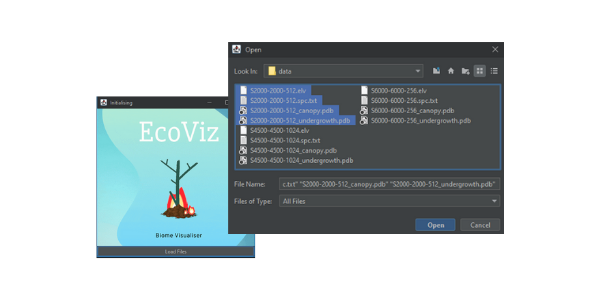
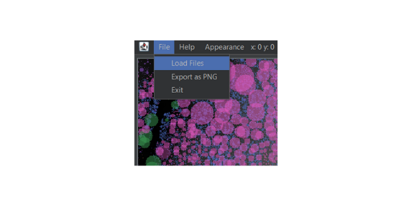
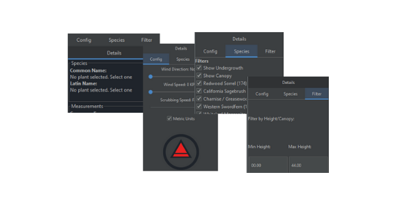
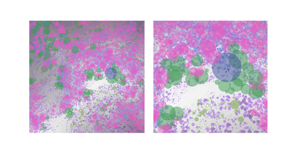
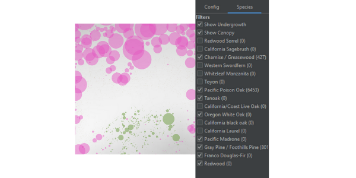
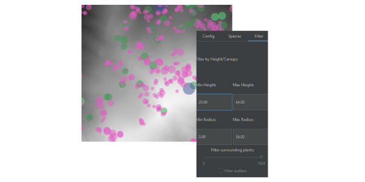
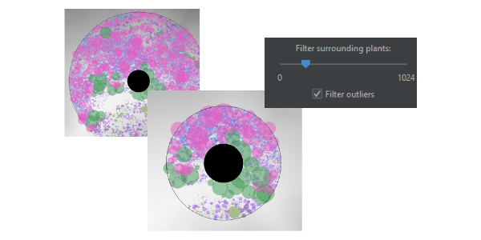
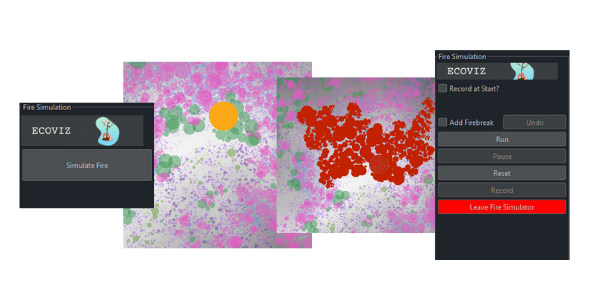
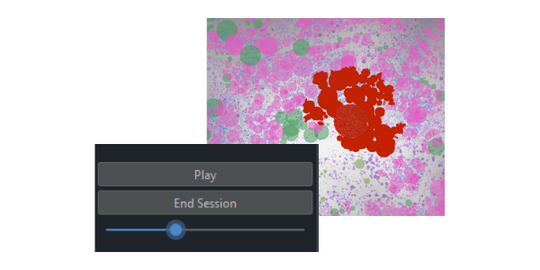
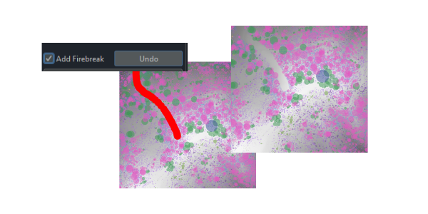

# Ecosystem Visualization

A Java-based computational biomodeling application that visualizes and simulates botanical ecosystems, with a focus on wildfire impact analysis.

## Features

- **Interactive Ecosystem Visualization**: Explore a 2D model of plant life overlaid on a grayscale elevation map.
- **Environmental Data Analysis**: Analyze and filter data for different plant species and ecosystem conditions.
- **Fire Impact Simulation**: Simulate fire spread and evaluate potential firebreak locations.
- **Real-time Interactivity**: Dynamic manipulation of the environment model with an intuitive graphical user interface.

## Screenshots

Here are some screenshots of the application in action:

- Program initialisation.

- Loading new files.

- Panel navigation.

- Terrain zooming.

- Species filtering.

- Height and radius filtering.

- Display species within radius.

- Fire simulation.

- Session replay.

- Fire break mode.

## Documentation

For a comprehensive guide on the application, its design, and the underlying models, refer to the full [EcoViz Documentation](EcoViz.pdf).

## Authors

James Burness, Jacq van Jaarsveld, Owen Franke
